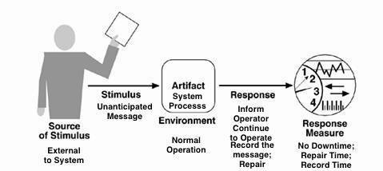
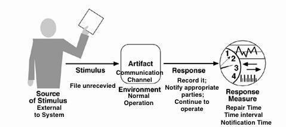
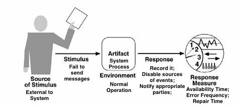
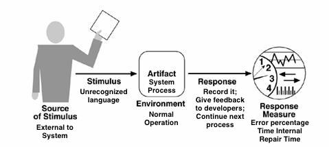
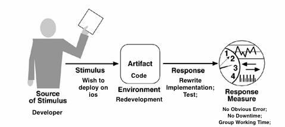
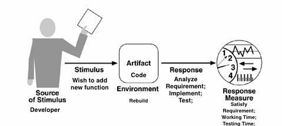
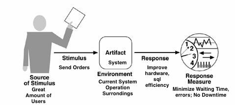
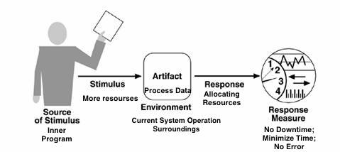

# 
 Nanjing University

## 
Software Systems Design & Architecture 

## 
 Assignment 1

## 
 In Software Engineering Institute

## 
 by 161250096 Yu Pan

## 
 Mail: panyuyuyu@outlook.com

### 
  © Nanjing, 2018. 

### 
 All rights reserved.

## Introduction

My survey is based on two pairs of quality of attributes: stability vs. reliability, extensibility vs. scalability. The survey has three parts:

1. Scenarios

2. Analysis of relationships and differences of each pair

3. Strategies to improve each quality attribute combined with tactics

4. Reference

## 1. Scenarios

### Stability

|Portion of Scenario|Possible values|
|---|---|
|Source|Internal to the system; external to the system|
|Stimulus|Fault: omission, crash, timing, response|
|Artifacts|System's processors, communication channels, persistent storage, processes|
|Environment|Normal operation; degraded mode|
|Response|System should detect event and do one or more of the following:<ul><li>record it</li><li>notify appropriate parties, including the user and other systems</li><li>disable sources of events that cause fault or failure according to defined rules</li><li>be unavailable for a prespecified interval, where interval depends on criticality of system</li><li>continue to operate in normal or degraded mode</li></ul>|
|Response Measure|Time interval when the system must be available

Availability time

Time interval in which system can be in degraded mode Repair time|

#### A Translating System

The translating system deal with unanticipated messages m and the response measures:

- The judging time can be measured
- No Downtime
- Record time of m

#### A File Storage System

### Reliability

Portion of Scenario|Possible values|
|---|---|
|Source|Internal to the system; external to the system; developer|
|Stimulus|Fault: requirement definition, design, code, test|
|Artifacts|System's processors, processes|
|Environment|At design time, at development time, at compile time, at deployment time|
|Response|System should detect event and do one or more of the following: <ul><li>detect attack</li><li>notify appropriate parties, including the user and other systems</li><li>disable sources of events that cause fault or failure according to defined rules</li><li>be unavailable for a prespecified interval, where interval depends on criticality of system</li><li>continue to operate in normal or degraded mode</li></ul>|
|Response Measure|Time interval when the system must be available

Availability time

Time interval in which system can be in degraded mode Repair time|

#### A chat room

**Once the "time out" appeared,  action should be taken to solve the problem**

#### NLP unable to process language

**NLP program fail to detect some terrible language data.**

### extensibility

**Similar to modifiability, while focus more on "extend".**

Portion of Scenario|Possible values|
|---|---|
|Source|End user, developer, system administrator|
|Stimulus|Wishes to add/delete/modify/vary functionality|
|Artifacts|System user interface, platform, environment; system that interoperates with target system|
|Environment|At runtime, compile time, build time, design time (All re-process like rebuild, redevelopment, rewrite)|
|Response|Locates places in software and hardware to be expanded; makes expansions without affecting other functionality; tests expansions; deploys expansions|
|Response Measure|Cost in terms of number of elements affected, effort, money; extent to which this affects other functions or quality attributes|

#### System should also be deployed on ios platform

**Assuming that the programmer are unfortunate to transfer the java project to swift to deploy.**

#### New function "Object Detection" should be added

### scalability

**Though I think in some place it may be similar to extensibility, I still try to distinguish between them, like environments...**

Portion of Scenario|Possible values|
|---|---|
|Source|Internal to the system; external to the system|
|Stimulus|Lists of tasks, more events|
|Artifacts|System or improved system|
|Environment|Current system operation surroundings|
|Response|Improve hardware; Reallocate resources; Memory management|
|Response Measure|Cost in terms of number of elements affected, effort, money; extent to which this affects other functions or quality attributes|

#### A great amount of orders on 11.11

**Engineers in Alibaba Group have to face great amount of orders on 11.11.**

#### A terrible recursive procedure like F(668) = F(666) + F(667)

## Part2 Relationships and differences

### Stability vs. Reliability

Before providing the proper definition of the two attributes, imagine such scene: I have an app, it works perfectly at most of the time. Unfortunately, "time out" can be seen randomly at some moment while unused. However, all the data are saved and I can use it without worrying about losing data.

From my perspective, **the app is successful for no data loss. Attention, no data loss is my aim and I don't care when "time out" appeared and when "time out" will appear. Therefore, the app is reliable but is not stable.**

From this example, I want to stress that there is a obvious difference between 'stable' and 'reliable'. Stable means the given system can continuously run despite the negative impact. While a reliable system has the ability to withstand the failure and can recover from such situation.

As can be seen from ISO 9126 Standard:

Stability is : Characterizes the sensitivity to change of a given system that is the negative impact that may be caused by system changes.

Reliability is a main characteristic that contains:

- maturity : This sub characteristic concerns frequency of failure of the software.
- fault tolerance : The ability of software to withstand (and recover) from component, or environmental, failure.
- recoverability : Ability to bring back a failed system to full operation, including data and network connections.

For programmers, code is more helpful for understanding. Thinking about writing a program to add two numbers:

Reliable but unstable:

    add(a, b):
        if randomInt.isOdd():
            throw exception
        else:
            return a + b

Stable but unreliable:

    add(a, b):
        if randomInt.isOdd():
            return 666
        else:
            return a + b

Though simple, the example vividly reveals the difference between stability and reliability. The program can give a true result as long as it is in normal status and it can recover from exception. So it is the positive aspects of reliability. While the program can run without caring whether the output (behavior). It is the positive aspects of stability. The two attributes have the relationships for the program running, but differs in aim (or the judgement).

### extensibility vs. scalability

There is a difference between extensibility and scalability.

Scalability means a system is able to accommodate growth. For example, with the growth of tasks, the system can still perform perfectly, which means the system has a good scalability. It is about the number of tasks a system can execute at the same time. This usually maps almost directly to the number of concurrent users that an application can support. Some more examples are listed as questions:

- How many database operations can be done at 11.11?
- Can another 100 visitors using the web service at the same time?

Extensibility means you are able to (easily) add something to the system. Some change may be done to the existed system.

- Can the database schema flex to accommodate change?
- Can the framework allows IoC?
- Can 3rd party users leverage the system?

## Part3 Strategies and Tactics

<table>
    <tr><th>QA</th>
        <th>Strategy</th>
        <th>Tactic</th>
        <th>Impact</th>
    </tr>
    <tr>
        <th rowspan="4">Stability</th>
        <th rowspan="2">Fault Detection</th>
        <th>Ping/echo</th>
        <th align="left"> "Ping/echo" fault detectors can be organized in a hierarchy, in which a lowest-level detector pings the software processes with which it shares a processor, and the higher-level fault detectors ping lower-level ones. However, it is hard to give a full judgement and sometimes cause extra time cost.</th>
    </tr>
    <tr>
     <th>Heartbeat</th>
        <th align="left">One component emits a heartbeat message periodically and another component listens for it. Thus it is able to give real-time feedback. While redundancy is unavoidable in some case. The function of components can be mixed since the heartbeat can also carry data.</th>
    </tr>
    <tr>
      <th rowspan="2">Fault Prevention</th>
        <th>Transactions</th>
        <th align="left">Transactions prevents any data from being affected if one step in a process fails and also to prevent collisions among several simultaneous threads accessing the same data. But it reduces efficiency, especially in the case of big data concurrency.</th>
    </tr>
    <tr>
     <th>Process monitor</th>
        <th align="left">Monitoring process can delete the nonperforming process and create a new instance of it, initialized to some appropriate state as in the spare tactic. However, it may not be reliable. Monitor itself consumes resources.</th>
    </tr>
    <tr>
        <th rowspan="4">Reliability</th>
        <th rowspan="2">Fault Recovery</th>
        <th>Checkpoint/rollback</th>
        <th align="left">A checkpoint is a recording of a consistent state created either periodically or in response to specific events. But it can cause risk of data loss when inappropriate rollback. It is a extra burden on machine.</th>
    </tr>
    <tr>
     <th>Spare</th>
        <th align="left">A standby spare computing platform is configured to replace many different failed components. While it must be rebooted to the appropriate software configuration and have its state initialized when a failure occurs. </th>
    </tr>
    <tr>
      <th rowspan="2">Fault Detection</th>
        <th>Exceptions</th>
        <th align="left">One method for recognizing faults is to encounter an exception. But it may not be stable when some exception unhandled or missed.</th>
    </tr>
    <tr>
     <th>Ping/echo</th>
        <th>A checkpoint is a recording of a consistent state created either periodically or in response to specific events. But it can cause risk of data loss when inappropriate rollback. It is a extra burden on machine. It may not test the whole process.</th>
    </tr>
    <tr>
        <th rowspan="4">Extensibility</th>
        <th rowspan="2">Localize modifications</th>
        <th>Anticipate expected changes</th>
        <th>Considering the set of envisioned changes provides a way to evaluate a particular assignment of responsibilities. In reality this tactic is difficult to use by itself since it is not possible to anticipate all changes. In my course Software Construction, teacher told us "Don;t"</th>
    </tr>
    <tr>
     <th>Generalize the module</th>
        <th>The more general a module, the more likely that requested changes can be made by adjusing the input language rather than by modifying the module. However, it is not easy to modify an appropriate module.</th>
    </tr>
    <tr>
      <th rowspan="2">Prevent ripple effects</th>
        <th>Restrict communication paths</th>
        <th align="left">This will reduce the ripple effect since data production/consumption introduces dependencies that cause ripples. But it is hard to rewrite if needed since the data is not shared.</th>
    </tr>
    <tr>
     <th>Maintain existing interfaces</th>
        <th align="left">If B depends on the name and signature of an interface of A, maintaining this interface and its syntax allows B to remain unchanged. While this tactic will not necessarily work if B has a semantic dependency on A, since changes to the meaning of data and services are difficult to mask.</th>
    </tr>
    <tr>
        <th rowspan="4">Scalability</th>
        <th rowspan="2">Load balancing software</th>
        <th>Offload the database</th>
        <th align="left">Stay away from the database as much as possible. Don’t open connections to it and don’t start transactions unless you have to. However, it usually can't give an immediately response. It seems not so perfect for users. Besides, such operation makes it hard to implement.</th>
    </tr>
    <tr>
     <th>Constrain concurrent access to limited resources</th>
        <th align="left">If more than one request accesses the same resource and performs the same calculation, it is better to proceed with the first and let the others wait until it finishes its job to just use the final results. But it is hard to extend.</th>
    </tr>
    <tr>
      <th rowspan="2">Staged, asynchronous processing</th>
        <th>Separate a process </th>
        <th align="left">Separating a process through asynchronicity into discrete, separate steps separated by queues and executed by a limited number of workers/threads in each step will quite often do wonders for both scalability and performance. But it is not easy to make priority on these tasks.</th>
    </tr>
    <tr>
     <th>Location</th>
        <th align="left">Put things close to where they are supposed to be delivered. But it is hard to change and can cause chain reactions.</th>
    </tr>
</table>

## Reference

1. The 7 Software “-ilities” You Need To Know(http://codesqueeze.com/the-7-software-ilities-you-need-to-know/ )
2. The ISO/IEC 9126 quality standard
3. Stability vs Reliability (https://softwareengineering.stackexchange.com/questions/158054/stability-vs-reliability)
4. Scalable VS Extensible(https://stackoverflow.com/questions/15926758/scalable-vs-extensible)
5. Software_Architecture_in_Practice_2nd_Edition
6. https://blog.ipswitch.com/eight-ways-achieve-system-stability
7. http://etutorials.org/Programming/Software+architecture+in+practice,+second+edition/Part+Two+Creating+an+Architecture/Chapter+5.+Achieving+Qualities/5.2+Availability+Tactics/
8. The Importance of Scalability In Software Design(https://conceptainc.com/blog/importance-of-scalability-in-software-design/)